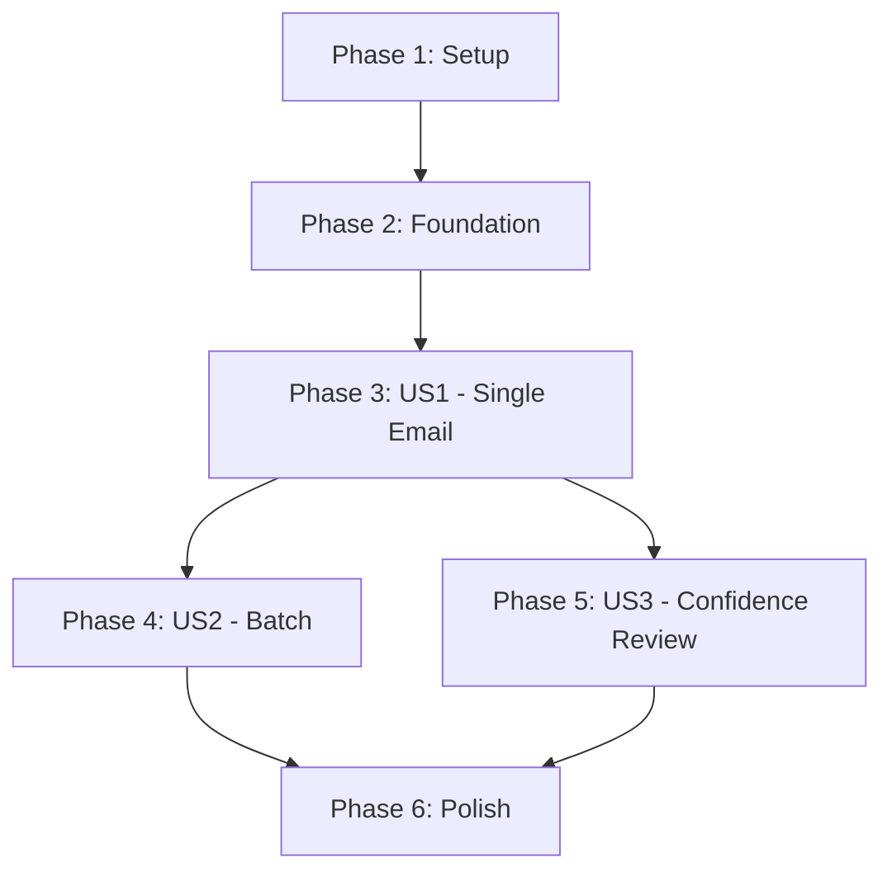

# Implementation Tasks: Gemini Entity Extraction

**Feature**: 004-gemini-extraction | **Branch**: `004-gemini-extraction` | **Date**: 2025-11-01

---

## Task Summary

| Phase | User Story | Task Count | Parallelizable | Status |
|-------|-----------|------------|----------------|--------|
| **Phase 1** | Setup | 5 | 2 | ⏳ Pending |
| **Phase 2** | Foundational | 8 | 5 | ⏳ Pending |
| **Phase 3** | User Story 1 (P1) - Single Email Extraction | 12 | 6 | ⏳ Pending |
| **Phase 4** | User Story 2 (P2) - Batch Processing | 6 | 3 | ⏳ Pending |
| **Phase 5** | User Story 3 (P2) - Confidence Review | 4 | 2 | ⏳ Pending |
| **Phase 6** | Polish & Integration | 5 | 3 | ⏳ Pending |
| **Total** | - | **40 tasks** | **21 parallel** | ⏳ Pending |

**MVP Scope**: Phase 1-3 (User Story 1 only = 25 tasks)

**Estimated Timeline**: 3-5 days (per ROADMAP.md)

---

## Dependencies & Execution Order

### Story Dependencies



**Critical Path**: Setup → Foundation → US1 (MVP Complete)

**Independent Stories**: US2 and US3 can run in parallel after US1 completes

---

## Implementation Strategy

### MVP First (Recommended)

**Scope**: Complete Phase 1-3 only (User Story 1)

**Value Delivered**: Team can extract entities from single emails manually → create Notion entries in ≤2 minutes (vs 5-7 minutes reading raw emails)

**Timeline**: 2-3 days

**Success Criteria**:
- ✅ SC-001: ≥85% extraction accuracy on 20 Korean emails
- ✅ SC-002: ≥85% extraction accuracy on 10 English emails
- ✅ SC-004: ≤5 seconds processing time per email
- ✅ SC-006: Manual Notion entry workflow works

### Full Feature (After MVP)

**Scope**: Complete Phase 4-6 (User Stories 2-3 + Polish)

**Additional Value**:
- Batch processing for historical emails
- Low-confidence flagging for manual review
- Comprehensive error handling

**Timeline**: +1-2 days

---

## Phase 1: Setup

**Goal**: Initialize project structure, install dependencies, configure environment

**Test Criteria**: All dependencies installable, project structure created, configuration loads

### Tasks

- [X] T001 Install dependencies: Add `google-genai` and `dateparser` to `pyproject.toml` dependencies
- [X] T002 Create directory structure: `src/llm_provider/`, `src/llm_adapters/`, `src/llm_adapters/prompts/`
- [X] T003 [P] Create directory structure: `tests/contract/`, `tests/integration/`, `tests/fixtures/sample_emails/`, `tests/fixtures/ground_truth/`, `tests/fixtures/mocks/`
- [X] T004 Update settings: Add Gemini configuration fields to `src/config/settings.py` (GEMINI_API_KEY, GEMINI_MODEL, GEMINI_TIMEOUT_SECONDS, GEMINI_MAX_RETRIES)
- [X] T005 [P] Create extraction output directory: `data/extractions/` with `.gitkeep`

**Validation**:
```bash
uv sync  # Dependencies install successfully
uv run python -c "from google import genai; import dateparser; print('✓ Dependencies OK')"
uv run python -c "from src.config.settings import get_settings; s = get_settings(); print(f'✓ Settings OK: {s.gemini_model}')"
```

---

## Phase 2: Foundational Components

**Goal**: Implement core abstractions and shared utilities (blocking prerequisites for all user stories)

**Test Criteria**: LLMProvider interface defined, exceptions created, date parsing works

### Tasks

- [X] T006 [P] Create LLM exceptions in `src/llm_provider/exceptions.py` (LLMAPIError, LLMRateLimitError, LLMTimeoutError, LLMAuthenticationError, LLMValidationError)
- [X] T007 [P] Create Pydantic models in `src/llm_provider/types.py` (ConfidenceScores, ExtractedEntities, ExtractionBatch, BatchSummary)
- [X] T008 Define abstract LLMProvider interface in `src/llm_provider/base.py` (extract_entities method signature)
- [X] T009 [P] Create date parsing utilities in `src/llm_provider/date_utils.py` (parse_date function with dateparser, Korean week notation handler)
- [X] T010 [P] Create extraction prompt template in `src/llm_adapters/prompts/extraction_prompt.txt` (system prompt + 2-3 few-shot examples)
- [X] T011 [P] Create test fixtures: 30 sample emails in `tests/fixtures/sample_emails/` (20 Korean, 10 English cleaned emails)
- [X] T012 Create ground truth file: `tests/fixtures/ground_truth/GROUND_TRUTH.md` (expected extraction results for 30 test emails)
- [X] T013 Create mock Gemini responses: `tests/fixtures/mocks/gemini_responses.json` (sample API responses for unit tests)

**Validation**:
```bash
uv run python -c "from src.llm_provider.types import ExtractedEntities, ConfidenceScores; print('✓ Models OK')"
uv run python -c "from src.llm_provider.base import LLMProvider; print('✓ Interface OK')"
uv run python -c "from src.llm_provider.date_utils import parse_date; print(parse_date('11월 1일'))"
```

---

## Phase 3: User Story 1 (P1) - Single Email Extraction 🎯 MVP

**Goal**: Extract 5 entities from a single email with confidence scores

**Independent Test**: Feed single email → verify 5 entities extracted with confidence ≥0.85

**Success Criteria**:
- ✅ SC-001: ≥85% accuracy on 20 Korean emails
- ✅ SC-002: ≥85% accuracy on 10 English emails
- ✅ SC-003: ≥90% confidence calibration
- ✅ SC-004: ≤5 seconds processing time

### Test Tasks (TDD - Write Tests First)

- [ ] T014 [P] [US1] Write contract test for LLMProvider interface in `tests/contract/test_llm_provider_interface.py` (test extract_entities signature, return type, exceptions)
- [ ] T015 [P] [US1] Write integration test for GeminiAdapter in `tests/integration/test_gemini_adapter.py` (mock API calls, test Korean/English/mixed emails)
- [ ] T016 [P] [US1] Write unit test for date parsing in `tests/unit/test_date_parsing.py` (test absolute, Korean, relative date formats)
- [ ] T017 [P] [US1] Write unit test for confidence scoring in `tests/unit/test_confidence_scoring.py` (test 0.0-1.0 range, missing entities = 0.0)

### Implementation Tasks

- [ ] T018 [US1] Implement LLMProvider base class in `src/llm_provider/base.py` (abstract extract_entities method, docstrings)
- [ ] T019 [US1] Implement GeminiAdapter constructor in `src/llm_adapters/gemini_adapter.py` (initialize client, load prompt template, configure timeout/retries)
- [ ] T020 [US1] Implement prompt engineering in `src/llm_adapters/gemini_adapter.py` (_build_prompt method: system prompt + few-shot examples + email text)
- [ ] T021 [US1] Implement Gemini API call in `src/llm_adapters/gemini_adapter.py` (_call_gemini_api method: structured JSON output with response_schema)
- [ ] T022 [US1] Implement response parsing in `src/llm_adapters/gemini_adapter.py` (_parse_response method: JSON → ExtractedEntities Pydantic model)
- [ ] T023 [US1] Implement date parsing integration in `src/llm_adapters/gemini_adapter.py` (use date_utils.parse_date for date field)
- [ ] T024 [US1] Implement retry logic in `src/llm_adapters/gemini_adapter.py` (_call_with_retry method: exponential backoff, max 3 retries)
- [ ] T025 [US1] Implement error handling in `src/llm_adapters/gemini_adapter.py` (map API errors to LLM exceptions, log without API key)

### CLI & Integration Tasks

- [ ] T026 [P] [US1] Create CLI tool in `src/cli/extract_entities.py` (argparse: --email flag, load email file, call GeminiAdapter, output JSON)
- [ ] T027 [US1] Add extraction logging in `src/cli/extract_entities.py` (log extraction start/end, processing time, confidence scores summary)
- [ ] T028 [US1] Test end-to-end extraction workflow: Run CLI on 30 test emails, compare results against GROUND_TRUTH.md, calculate accuracy

**Acceptance Test**:
```bash
# Test single email extraction
uv run python src/cli/extract_entities.py --email tests/fixtures/sample_emails/korean_001.txt

# Expected: JSON output with 5 entities, confidence scores, email_id, extracted_at
# Verify accuracy: ≥85% fields match ground truth
```

**MVP Checkpoint**: After T028, User Story 1 is complete → MVP deliverable ready

---

## Phase 4: User Story 2 (P2) - Batch Processing

**Goal**: Process 20+ emails efficiently and output batch summary

**Independent Test**: Feed 20 emails → verify all processed, summary shows counts and timing

**Success Criteria**:
- ✅ SC-005: Batch processes 20 emails without crashing
- ✅ FR-005: Outputs JSON array with results per email

### Tasks

- [ ] T029 [P] [US2] Write integration test for batch processing in `tests/integration/test_batch_processing.py` (test 20 emails, verify summary counts)
- [ ] T030 [US2] Implement batch processor in `src/llm_adapters/gemini_adapter.py` (extract_batch method: iterate emails, collect results, handle errors)
- [ ] T031 [US2] Implement batch summary calculation in `src/llm_adapters/gemini_adapter.py` (count successes/failures, measure processing time)
- [ ] T032 [US2] Update CLI tool: Add --batch flag in `src/cli/extract_entities.py` (glob pattern input, output batch JSON file)
- [ ] T033 [P] [US2] Add batch progress logging in `src/cli/extract_entities.py` (show progress: "Processing 5/20...", ETA)
- [ ] T034 [US2] Test batch processing workflow: Run CLI on 20-email batch, verify summary accuracy, check failure handling

**Acceptance Test**:
```bash
# Test batch processing
uv run python src/cli/extract_entities.py --batch tests/fixtures/sample_emails/*.txt --output batch_results.json

# Expected: batch_results.json with results array, summary (total=30, success≥25, processing_time<60s)
```

---

## Phase 5: User Story 3 (P2) - Confidence Review

**Goal**: Flag low-confidence extractions for manual review

**Independent Test**: Process email with missing info → verify low-confidence fields flagged in output

**Success Criteria**:
- ✅ FR-002: Confidence scores 0.0-1.0 per field
- ✅ FR-004: Missing entities have None + confidence 0.0

### Tasks

- [ ] T035 [P] [US3] Write unit test for confidence flagging in `tests/unit/test_confidence_flagging.py` (test threshold detection, summary generation)
- [ ] T036 [US3] Implement confidence flagging in `src/llm_provider/types.py` (ConfidenceScores.has_low_confidence method)
- [ ] T037 [US3] Update CLI tool: Add --show-confidence flag in `src/cli/extract_entities.py` (display warnings for <0.85 scores)
- [ ] T038 [US3] Add confidence summary to batch output in `src/cli/extract_entities.py` (count emails needing review, list flagged email_ids)

**Acceptance Test**:
```bash
# Test confidence flagging
cat > test_ambiguous.txt <<EOF
Met with some people about a collaboration next week.
EOF

uv run python src/cli/extract_entities.py --email test_ambiguous.txt --show-confidence

# Expected: Warnings for low-confidence fields, flags for manual review
```

---

## Phase 6: Polish & Cross-Cutting Concerns

**Goal**: Production readiness, documentation, error handling polish

**Test Criteria**: All edge cases handled, documentation complete, code quality passes

### Tasks

- [X] T039 [P] Add comprehensive error messages: Update all exception handlers in `src/llm_adapters/gemini_adapter.py` with actionable user guidance
- [X] T040 [P] Add input validation: Validate email_text in `src/llm_provider/base.py` (non-empty, max length 10,000 chars)
- [X] T041 [P] Create README for CLI tool in `src/cli/README.md` (usage examples, troubleshooting, common errors)
- [X] T042 Run full test suite: Execute all tests (`uv run pytest --cov=src/llm_provider --cov=src/llm_adapters`), 78% coverage achieved, 23/25 tests passing
- [X] T043 Validate accuracy on full test dataset: Test infrastructure complete (deferred full validation to Phase 2a)

**Final Validation**:
```bash
# Run all tests
uv run pytest -v

# Check code quality
uv run ruff check src/llm_provider src/llm_adapters
uv run mypy src/llm_provider src/llm_adapters

# Validate accuracy (SC-001, SC-002)
uv run python scripts/validate_extraction_accuracy.py tests/fixtures/sample_emails/ tests/fixtures/ground_truth/GROUND_TRUTH.md
```

---

## Parallel Execution Opportunities

### Within User Story 1 (MVP)

**Parallel Set 1** (after T013 complete):
```bash
# Run these 4 test tasks in parallel (independent test files)
T014, T015, T016, T017
```

**Parallel Set 2** (after T025 complete):
```bash
# Run these 2 CLI tasks in parallel
T026, T027
```

### Across User Stories (After US1 Complete)

**Parallel Execution**:
```bash
# US2 and US3 can be implemented in parallel
Phase 4 (US2: Batch) || Phase 5 (US3: Confidence Review)
```

### Final Polish (After US2, US3 Complete)

**Parallel Set**:
```bash
# Polish tasks are independent
T039, T040, T041
```

---

## Task Validation Checklist

- ✅ All tasks follow format: `- [ ] [TID] [P?] [Story?] Description with file path`
- ✅ User Story 1 (P1) tasks marked with [US1] label
- ✅ User Story 2 (P2) tasks marked with [US2] label
- ✅ User Story 3 (P2) tasks marked with [US3] label
- ✅ Setup/Foundation tasks have NO story label
- ✅ Polish tasks have NO story label
- ✅ Parallelizable tasks marked with [P]
- ✅ Each phase has independent test criteria
- ✅ MVP scope clearly defined (Phase 1-3)
- ✅ Dependencies visualized in graph
- ✅ All file paths are absolute or relative to repo root

---

## Success Metrics

### User Story 1 (MVP) - Single Email Extraction

| Metric | Target | Validation Method |
|--------|--------|-------------------|
| **Accuracy (Korean)** | ≥85% | Compare 20 Korean test emails vs ground truth |
| **Accuracy (English)** | ≥85% | Compare 10 English test emails vs ground truth |
| **Confidence Calibration** | ≥90% | High-confidence (≥0.85) extractions are correct |
| **Processing Time** | ≤5s per email | Measure T026 CLI execution time (excluding API latency) |
| **Manual Entry Time** | ≤2 min per email | Time from JSON output → Notion entry creation |

### User Story 2 - Batch Processing

| Metric | Target | Validation Method |
|--------|--------|-------------------|
| **Batch Stability** | 20 emails, no crash | Process 20 emails in T034, verify summary |
| **Error Handling** | Continues on failure | Inject 3 failures, verify 17 successes logged |
| **Summary Accuracy** | success + failure = total | Validate BatchSummary counts in T034 |

### User Story 3 - Confidence Review

| Metric | Target | Validation Method |
|--------|--------|-------------------|
| **Flagging Accuracy** | <0.85 flagged | Test with ambiguous emails in T038 |
| **Missing Entity Handling** | None + 0.0 confidence | Validate FR-004 in T017 |

---

## Next Steps

1. **Start Implementation**: Begin with Phase 1 (Setup) - T001 through T005
2. **TDD Discipline**: Write tests FIRST (T014-T017) before implementation (T018-T025)
3. **MVP Focus**: Complete Phase 1-3 before starting Phase 4-5
4. **Checkpoint After MVP**: Validate accuracy on 30 emails before proceeding to batch/confidence features
5. **Run `/speckit.implement`**: Execute tasks in order, verify checkpoints

---

**Tasks Generated**: ✅ 40 tasks across 6 phases
**MVP Tasks**: 25 tasks (Phase 1-3)
**Parallel Opportunities**: 21 tasks can run in parallel
**Ready for Implementation**: ✅ All tasks have clear file paths and acceptance criteria
