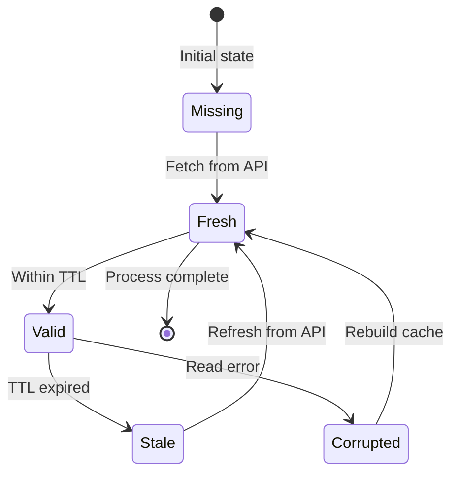
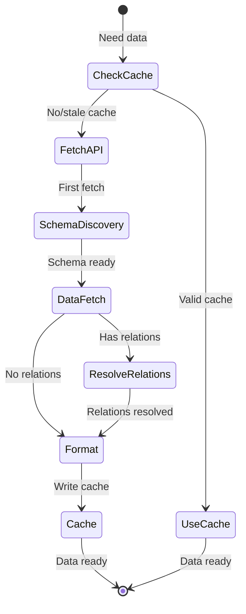

# Data Model: Notion Read Operations

**Feature**: 006-notion-read
**Date**: 2025-11-02
**Purpose**: Define entities, relationships, and data structures for Notion API integration

---

## Entity Overview

This feature manages six primary entities:

1. **NotionDatabase** - Represents a Notion database (Companies or CollabIQ)
2. **NotionProperty** - Represents a field/property within a database
3. **NotionRecord** - Represents a single page/record from a database
4. **DatabaseSchema** - Complete structure definition for a database
5. **DataCache** - Cached schema and data with TTL metadata
6. **RelationshipGraph** - Tracks inter-database relationships

---

## Entity Definitions

### NotionDatabase

Represents a Notion database with its metadata and schema.

**Fields**:
- `id` (str): Notion database ID (UUID format)
- `title` (str): Human-readable database name
- `url` (str): Notion URL to the database
- `created_time` (datetime): When database was created
- `last_edited_time` (datetime): When database was last modified
- `properties` (Dict[str, NotionProperty]): All properties/fields in the database

**Validation Rules**:
- `id` must be valid UUID format
- `title` must not be empty
- `properties` must contain at least one property

**Source**: Notion API `/databases/{database_id}` endpoint

**Example**:
```python
NotionDatabase(
    id="abc123-def456-...",
    title="Companies",
    url="https://www.notion.so/workspace/abc123...",
    created_time=datetime(2025, 1, 1),
    last_edited_time=datetime(2025, 11, 1),
    properties={
        "Name": NotionProperty(...),
        "Shinsegae affiliates?": NotionProperty(...),
        "Is Portfolio?": NotionProperty(...)
    }
)
```

---

### NotionProperty

Represents a field/property in a Notion database with type information.

**Fields**:
- `id` (str): Notion property ID
- `name` (str): Property name (e.g., "Name", "Shinsegae affiliates?")
- `type` (str): Property type (title, rich_text, number, select, multi_select, date, checkbox, relation, etc.)
- `config` (Dict[str, Any]): Type-specific configuration

**Type-Specific Configurations**:

**Relation Property**:
```python
{
    "relation": {
        "database_id": "xyz789...",  # Target database ID
        "type": "dual_property",      # or "single_property"
        "dual_property": {...}        # If bidirectional
    }
}
```

**Select Property**:
```python
{
    "select": {
        "options": [
            {"name": "Option 1", "color": "blue", "id": "opt1"},
            {"name": "Option 2", "color": "red", "id": "opt2"}
        ]
    }
}
```

**Validation Rules**:
- `name` must not be empty
- `type` must be one of Notion's supported types
- For relation properties, `config.relation.database_id` must be valid

**Source**: Database schema from Notion API

**Example**:
```python
# Checkbox property
NotionProperty(
    id="prop_123",
    name="Shinsegae affiliates?",
    type="checkbox",
    config={}
)

# Relation property
NotionProperty(
    id="prop_456",
    name="Related CollabIQ",
    type="relation",
    config={
        "relation": {
            "database_id": "xyz789...",
            "type": "dual_property"
        }
    }
)
```

---

### NotionRecord

Represents a single page/record from a Notion database with all property values.

**Fields**:
- `id` (str): Page ID (UUID format)
- `database_id` (str): Parent database ID
- `created_time` (datetime): When record was created
- `last_edited_time` (datetime): When record was last modified
- `archived` (bool): Whether record is archived
- `properties` (Dict[str, Any]): Property values (type-dependent structure)

**Property Value Structures**:

**Title/Rich Text**:
```python
{
    "Name": {
        "type": "title",
        "title": [{"plain_text": "Company A"}]
    }
}
```

**Checkbox**:
```python
{
    "Shinsegae affiliates?": {
        "type": "checkbox",
        "checkbox": True
    }
}
```

**Relation** (unresolved):
```python
{
    "Related CollabIQ": {
        "type": "relation",
        "relation": [
            {"id": "page_123"},
            {"id": "page_456"}
        ]
    }
}
```

**Relation** (resolved - with fetched data):
```python
{
    "Related CollabIQ": {
        "type": "relation",
        "relation": [{"id": "page_123"}],
        "_resolved": [NotionRecord(...)]  # Fetched related records
    }
}
```

**Validation Rules**:
- `id` must be valid UUID
- `database_id` must reference existing database
- `properties` must match database schema

**Source**: Notion API `/databases/{database_id}/query` or `/pages/{page_id}`

**Example**:
```python
NotionRecord(
    id="page_123",
    database_id="abc123...",
    created_time=datetime(2025, 10, 1),
    last_edited_time=datetime(2025, 11, 1),
    archived=False,
    properties={
        "Name": {"type": "title", "title": [{"plain_text": "Company A"}]},
        "Shinsegae affiliates?": {"type": "checkbox", "checkbox": False},
        "Is Portfolio?": {"type": "checkbox", "checkbox": True}
    }
)
```

---

### DatabaseSchema

Complete structure definition for a database including all properties and metadata.

**Fields**:
- `database` (NotionDatabase): Database metadata
- `properties_by_type` (Dict[str, List[NotionProperty]]): Properties grouped by type
- `relation_properties` (List[NotionProperty]): Subset of properties that are relations
- `classification_fields` (Dict[str, str]): Maps classification field names to property IDs

**Computed Fields**:
- `has_relations` (bool): True if any relation properties exist
- `property_count` (int): Total number of properties

**Validation Rules**:
- `database` must be valid NotionDatabase
- `classification_fields` should identify "Shinsegae affiliates?" and "Is Portfolio?" if present

**Purpose**: Provides structured view of database schema for validation and processing

**Example**:
```python
DatabaseSchema(
    database=NotionDatabase(...),
    properties_by_type={
        "title": [NotionProperty(name="Name", ...)],
        "checkbox": [
            NotionProperty(name="Shinsegae affiliates?", ...),
            NotionProperty(name="Is Portfolio?", ...)
        ],
        "relation": [NotionProperty(name="Related CollabIQ", ...)]
    },
    relation_properties=[NotionProperty(name="Related CollabIQ", ...)],
    classification_fields={
        "is_shinsegae_affiliate": "prop_ssg",
        "is_portfolio_company": "prop_portfolio"
    }
)
```

---

### DataCache

Cached data with metadata for TTL validation and integrity checking.

**Fields**:
- `cache_type` (str): "schema" or "data"
- `database_id` (str): Which database this cache belongs to
- `database_name` (str): Human-readable name
- `cached_at` (datetime): When cache was created
- `ttl_hours` (int): Time-to-live in hours
- `expires_at` (datetime): Computed expiration time
- `content` (Dict[str, Any] | List[Any]): Cached data (schema dict or records list)
- `metadata` (Dict[str, Any]): Additional metadata (record count, version, etc.)

**Computed Fields**:
- `is_expired` (bool): True if current time > expires_at
- `age_hours` (float): Hours since cached_at

**Validation Rules**:
- `cache_type` must be "schema" or "data"
- `database_id` must be valid UUID
- `ttl_hours` must be positive integer
- `content` must not be empty

**File Storage Format**:
```json
{
    "cache_type": "data",
    "database_id": "abc123...",
    "database_name": "Companies",
    "cached_at": "2025-11-02T10:30:00Z",
    "ttl_hours": 6,
    "expires_at": "2025-11-02T16:30:00Z",
    "content": [...],
    "metadata": {
        "record_count": 123,
        "has_archived": false,
        "fetch_duration_seconds": 21.5
    }
}
```

**Cache Files**:
- Schema: `data/notion_cache/schema_{database_name}.json`
- Data: `data/notion_cache/data_{database_name}.json`

**Example**:
```python
DataCache(
    cache_type="data",
    database_id="abc123...",
    database_name="Companies",
    cached_at=datetime.now(),
    ttl_hours=6,
    expires_at=datetime.now() + timedelta(hours=6),
    content=[NotionRecord(...), NotionRecord(...)],
    metadata={
        "record_count": 123,
        "has_archived": False
    }
)
```

---

### RelationshipGraph

Tracks relationships between databases for dependency resolution and circular reference detection.

**Fields**:
- `databases` (Dict[str, NotionDatabase]): All known databases by ID
- `relationships` (List[Relationship]): All relation properties across databases
- `adjacency_list` (Dict[str, List[str]]): Database ID → List of related database IDs

**Relationship Structure**:
```python
@dataclass
class Relationship:
    source_db_id: str
    source_property: NotionProperty
    target_db_id: str
    is_bidirectional: bool
```

**Computed Fields**:
- `has_circular_refs` (bool): True if any cycles detected
- `max_depth` (int): Maximum relationship depth in graph

**Purpose**:
- Detect circular relationships before resolution
- Optimize fetching order (fetch leaf nodes first)
- Validate relationship integrity

**Example**:
```python
RelationshipGraph(
    databases={
        "abc123": NotionDatabase(title="Companies", ...),
        "xyz789": NotionDatabase(title="CollabIQ", ...)
    },
    relationships=[
        Relationship(
            source_db_id="abc123",
            source_property=NotionProperty(name="Related CollabIQ", ...),
            target_db_id="xyz789",
            is_bidirectional=True
        )
    ],
    adjacency_list={
        "abc123": ["xyz789"],
        "xyz789": ["abc123"]
    }
)
```

---

## LLM Output Format

The formatted output for LLM consumption combines structured data with human-readable summaries.

### Structure

```python
@dataclass
class LLMFormattedData:
    companies: List[CompanyRecord]
    summary_markdown: str
    metadata: FormatMetadata

@dataclass
class CompanyRecord:
    id: str
    name: str
    classification: CompanyClassification
    source_database: str
    properties: Dict[str, Any]  # All other properties
    related_records: List[RelatedRecord]  # Resolved relationships

@dataclass
class CompanyClassification:
    is_shinsegae_affiliate: bool
    is_portfolio_company: bool
    collaboration_type_hint: str  # "SSG", "PortCo", "Both", "Neither"

@dataclass
class RelatedRecord:
    id: str
    name: str
    database: str
    properties: Dict[str, Any]  # Simplified view

@dataclass
class FormatMetadata:
    total_companies: int
    shinsegae_affiliate_count: int
    portfolio_company_count: int
    formatted_at: datetime
    data_freshness: str  # "cached" or "fresh"
```

### Example JSON Output

```json
{
    "companies": [
        {
            "id": "page_1",
            "name": "Company A",
            "classification": {
                "is_shinsegae_affiliate": false,
                "is_portfolio_company": true,
                "collaboration_type_hint": "PortCo"
            },
            "source_database": "Companies",
            "properties": {
                "industry": "Technology",
                "founded_year": 2020
            },
            "related_records": [
                {
                    "id": "collab_1",
                    "name": "Partnership with Company B",
                    "database": "CollabIQ",
                    "properties": {"type": "Strategic Alliance"}
                }
            ]
        }
    ],
    "summary_markdown": "# Company Database\n\n## Portfolio Companies (PortCo)\n- Company A\n\n## Shinsegae Affiliates (SSG)\n- Company B\n\n...",
    "metadata": {
        "total_companies": 123,
        "shinsegae_affiliate_count": 15,
        "portfolio_company_count": 45,
        "formatted_at": "2025-11-02T10:35:00Z",
        "data_freshness": "cached"
    }
}
```

---

## Relationships

### Database → Schema
- **Type**: One-to-One
- **Description**: Each database has exactly one schema
- **Lifecycle**: Schema cached separately with longer TTL (24h)

### Database → Records
- **Type**: One-to-Many
- **Description**: Each database contains multiple records/pages
- **Lifecycle**: Records cached together with shorter TTL (6h)

### Record → Record (via Relation Properties)
- **Type**: Many-to-Many
- **Description**: Records can reference other records via relation properties
- **Resolution**: Configurable depth (default 1 level)
- **Circular Handling**: Visited set tracking prevents infinite loops

### Database ↔ Database (via Relation Properties)
- **Type**: Many-to-Many
- **Description**: Databases linked via relation properties
- **Directionality**: Can be unidirectional or bidirectional
- **Example**: Companies → CollabIQ (one direction) or Companies ↔ CollabIQ (bidirectional)

---

## State Transitions

### Cache Lifecycle



### Data Fetch Lifecycle



---

## Data Validation Rules

### Schema Validation
1. Database ID must be valid UUID format
2. All properties must have unique names within database
3. Relation properties must reference valid target databases
4. Classification fields ("Shinsegae affiliates?", "Is Portfolio?") must be checkbox type

### Record Validation
1. Page ID must be valid UUID
2. All properties must match database schema
3. Checkbox values must be boolean
4. Relation arrays must contain valid page IDs

### Cache Validation
1. Cache file must be valid JSON
2. `cached_at` must be valid ISO 8601 datetime
3. `ttl_hours` must be positive integer
4. `database_id` must match filename
5. For data cache, `content` must be array of records

---

## Performance Considerations

### Memory Usage
- **Schema Cache**: ~10 KB per database (2 databases = ~20 KB)
- **Data Cache**: ~1-2 KB per record (500 records = ~500 KB - 1 MB)
- **In-Memory Processing**: Load one database at a time to minimize memory footprint

### Disk Usage
- **Cache Directory**: ~1-2 MB total for 500 records across 2 databases
- **Growth Rate**: Linear with record count

### API Call Optimization
- **Schema Discovery**: 1 call per database (cached for 24h)
- **Data Fetching**: ceil(record_count / 100) calls per database (pagination)
- **Relationship Resolution**: 1 call per unique related page (depth 1 = minimal calls)
- **Total for 500 records**: ~10-20 API calls (3-7 seconds with rate limiting)

---

## Error Handling

### Invalid Data Scenarios
1. **Malformed JSON in cache**: Delete cache, fetch fresh
2. **Missing required fields**: Log error, skip record, continue processing
3. **Invalid UUID**: Reject record, log error with page ID
4. **Relation to deleted page**: Mark as `{id, _deleted: true}` in output

### Data Consistency
1. **Schema change detection**: Compare cached schema hash with fetched schema
2. **Record count mismatch**: Log warning if significant discrepancy
3. **Partial fetch failure**: Use partial data + cached data, mark as incomplete

---

## Testing Considerations

### Unit Test Fixtures
- Sample NotionDatabase with 3-5 properties
- Sample NotionRecord with all property types represented
- Sample cache files (valid, expired, corrupted)

### Integration Test Scenarios
- Full schema discovery → data fetch → cache write → cache read cycle
- Relationship resolution with circular references
- Cache TTL expiration and refresh
- Rate limit compliance under high load

### Contract Test Requirements
- Verify Notion API response structure matches data model
- Validate property type parsing for all Notion types
- Test pagination cursor handling
- Verify relation property resolution

---

## Future Extensibility

**Potential Extensions** (out of scope for this feature):
1. **Real-time Updates**: Webhook support for cache invalidation
2. **Incremental Sync**: Fetch only changed records since last sync
3. **Multi-Database Queries**: Cross-database filtering and aggregation
4. **Custom Property Transformers**: User-defined property value transformations
5. **Cache Compression**: Gzip cache files for reduced disk usage

**Design Decisions Supporting Future Extensions**:
- Modular entity design (easy to add new entity types)
- Extensible cache metadata (can add version, checksum fields)
- Configurable relationship depth (can increase as needed)
- Pluggable formatters (can add new output formats for different LLMs)
