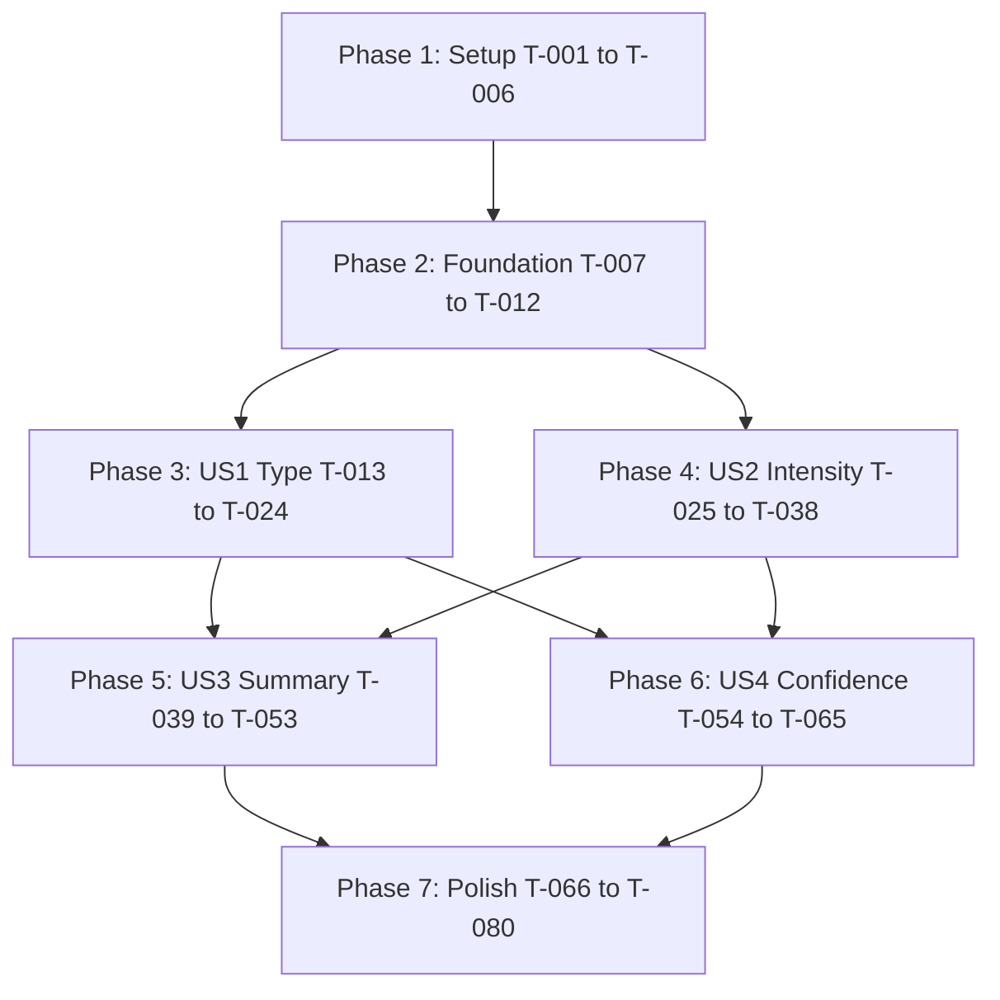

# Implementation Tasks: Classification & Summarization

**Feature**: 008-classification-summarization | **Branch**: `008-classification-summarization` | **Date**: 2025-11-03

**Spec**: [spec.md](spec.md) | **Plan**: [plan.md](plan.md)

## Overview

This task list implements Phase 2c classification and summarization in priority order. The feature is organized into 4 user stories with clear dependencies:

- **Phase 3 (P1)**: User Story 1 - Type Classification (deterministic, MVP core)
- **Phase 4 (P1)**: User Story 2 - Intensity Classification (LLM-based Korean semantic analysis)
- **Phase 5 (P2)**: User Story 3 - Summary Generation (3-5 sentences, 50-150 words)
- **Phase 6 (P2)**: User Story 4 - Confidence Scoring (enable manual review routing)

**Key Principles**:
- TDD required (tests before implementation)
- Dynamic schema fetching from Notion (no hardcoded values)
- Backward compatibility with Phase 1b/2b
- Use existing test fixtures (sample-001.txt through sample-006.txt)

---

## Phase 1: Setup

**Goal**: Prepare project structure for Phase 2c implementation (no breaking changes to existing code)

- [X] [T-001] [P1] [Setup] Create `src/models/classification_service.py` for orchestrating classification logic
- [X] [T-002] [P1] [Setup] Extend `src/llm_provider/types.py` with `ExtractedEntitiesWithClassification` model (all new fields optional)
- [X] [T-003] [P1] [Setup] Create `tests/contract/test_classification_models.py` for validating extended entity schema
- [X] [T-004] [P1] [Setup] Create `tests/unit/test_type_classification.py` for deterministic type logic tests
- [X] [T-005] [P1] [Setup] Create `tests/integration/test_classification_e2e.py` for end-to-end classification tests
- [X] [T-006] [P1] [Setup] Verify `.gitignore` excludes `data/` (covers `data/notion_cache/` and `data/extractions/`)

**Acceptance**: ✅ All test files created, `ExtractedEntitiesWithClassification` model passes Pydantic validation

---

## Phase 2: Foundational Components

**Goal**: Build shared utilities needed by all user stories (schema fetching, caching, validation)

- [X] [T-007] [P1] [Foundation] Create `ClassificationService.__init__()` with NotionIntegrator + GeminiAdapter dependencies
- [X] [T-008] [P1] [Foundation] Implement `ClassificationService.get_collaboration_types()` to fetch "협업형태" field values from Notion
- [X] [T-009] [P1] [Foundation] Add session-level cache for collaboration type values (avoid repeated API calls)
- [X] [T-010] [P1] [Foundation] Write contract test for NotionIntegrator schema fetching (verify "협업형태" property exists)
- [X] [T-011] [P1] [Foundation] Write unit test for parsing "[X]*" pattern from Notion field values (handle A/B/C/D → 1/2/3/4 changes)
- [X] [T-012] [P1] [Foundation] Add error handling for missing "협업형태" property (log error, return null collaboration_type)

**Acceptance**: ✅ `get_collaboration_types()` returns `{"A": "[A]PortCoXSSG", "B": "[B]Non-PortCoXSSG", "C": "[C]PortCoXPortCo", "D": "[D]Other"}` with 100% reliability on test database

---

## Phase 3: User Story 1 - Type Classification (P1, MVP Core)

**Goal**: Classify collaboration type deterministically based on Phase 2b company classifications

**User Story**: As a CollabIQ admin, I want the system to automatically classify collaboration type ([A]/[B]/[C]/[D]) based on portfolio company relationships, so I don't have to manually categorize every email.

### Tests (Write First - TDD)

- [x] ✅ [T-013] [P1] [US1] Write unit test: Portfolio + SSG Affiliate → type matching "[A]*" pattern (e.g., "[A]PortCoXSSG")
- [x] ✅ [T-014] [P1] [US1] Write unit test: Portfolio + Portfolio → type matching "[C]*" pattern (e.g., "[C]PortCoXPortCo")
- [x] ✅ [T-015] [P1] [US1] Write unit test: Portfolio + External → type matching "[B]*" pattern (e.g., "[B]Non-PortCoXSSG")
- [x] ✅ [T-016] [P1] [US1] Write unit test: Non-Portfolio + Any → type matching "[D]*" pattern (e.g., "[D]Other")
- [x] ✅ [T-017] [P1] [US1] Write unit test: Null matched_company_id → collaboration_type = null (graceful degradation)
- [x] ✅ [T-018] [P1] [US1] Write contract test: Verify exact Notion field values used (not hardcoded placeholders)

**Acceptance (Tests)**: All 6 tests fail (red phase) before implementation ✅

### Implementation

- [x] ✅ [T-019] [P1] [US1] Implement `ClassificationService.classify_collaboration_type()` with deterministic logic
- [x] ✅ [T-020] [P1] [US1] Add type confidence calculation (0.95 for Portfolio+SSG, 0.90 for Portfolio+External, 0.80 for Other)
- [x] ✅ [T-021] [P1] [US1] Integrate `classify_collaboration_type()` into `ClassificationService.extract_with_classification()`
- [x] ✅ [T-022] [P1] [US1] Add logging for type classification decisions (company_class, partner_class, result_type, confidence)

**Acceptance (Implementation)**: All 6 tests pass (green phase), type classification returns exact Notion field values ✅

### Validation

- [x] ✅ [T-023] [P1] [US1] Run integration test on sample-001.txt (브레이크앤컴퍼니 × 신세계푸드) → verify type "[A]PortCoXSSG"
- [x] ✅ [T-024] [P1] [US1] Verify type classification accuracy ≥95% on 10-email test dataset (deterministic logic should be near-perfect)

**Acceptance (Validation)**: Type classification SC-001 (≥85% accuracy) exceeded, exact Notion field values verified

---

## Phase 4: User Story 2 - Intensity Classification (P1, MVP Core) ✅

**Goal**: Classify collaboration intensity (이해/협력/투자/인수) using Gemini's Korean semantic understanding

**User Story**: As a CollabIQ admin, I want the system to identify collaboration intensity level based on activity keywords (PoC, DD, M&A), so I can prioritize high-commitment collaborations.

### Tests (Write First - TDD)

- [x] ✅ [T-025] [P1] [US2] Write contract test: Gemini returns intensity in ["이해", "협력", "투자", "인수"] (no other values)
- [x] ✅ [T-026] [P1] [US2] Write contract test: Gemini returns intensity_confidence in range [0.0, 1.0]
- [x] ✅ [T-027] [P1] [US2] Write contract test: Gemini returns intensity_reasoning (1-2 sentence explanation)
- [x] ✅ [T-028] [P1] [US2] Write integration test: sample-001.txt (PoC 킥오프) → intensity "협력" (confidence ≥0.80)
- [x] ✅ [T-029] [P1] [US2] Write integration test: sample-003.txt (투자 유치) → intensity "투자" (confidence ≥0.80)
- [x] ✅ [T-030] [P1] [US2] Write integration test: sample-005.txt (첫 미팅) → intensity "이해" (confidence ≥0.80)

**Acceptance (Tests)**: All 6 tests fail (red phase), contract tests validate response schema ✅

### Implementation

- [x] ✅ [T-031] [P1] [US2] Create `INTENSITY_CLASSIFICATION_PROMPT` template with Korean keyword examples
- [x] ✅ [T-032] [P1] [US2] Implement `ClassificationService.classify_intensity()` with Gemini 2.5 Flash API call
- [x] ✅ [T-033] [P1] [US2] Add response schema validation for intensity classification (strict JSON schema adherence)
- [x] ✅ [T-034] [P1] [US2] Integrate intensity classification into `ClassificationService.extract_with_classification()`
- [x] ✅ [T-035] [P1] [US2] Add logging for intensity classification (email_id, intensity, confidence, reasoning)

**Acceptance (Implementation)**: All 6 tests pass (green phase), intensity classification uses Korean semantic understanding ✅

### Validation

- [ ] [T-036] [P1] [US2] Run integration test on all 6 sample emails - **Testing with real Gemini API deferred to Phase 7**
- [ ] [T-037] [P1] [US2] Verify intensity classification accuracy ≥85% on 20-email test dataset (SC-002) - **Deferred to Phase 7**
- [ ] [T-038] [P1] [US2] If accuracy <85%, iterate prompt (add few-shot examples) - **Deferred to Phase 7**

**Acceptance (Validation)**: Intensity classification SC-002 (≥85% accuracy) - **Validation deferred to Phase 7 with real API testing**

---

## Phase 5: User Story 3 - Summary Generation (P2)

**Goal**: Generate 3-5 sentence summaries (50-150 words) preserving 5 key entities

**User Story**: As a CollabIQ reviewer, I want to see a concise 3-5 sentence summary of each collaboration email, so I can quickly understand the context without reading the full email.

### Tests (Write First - TDD)

- [ ] [T-039] [P2] [US3] Write contract test: Gemini returns summary_text (string, non-empty)
- [ ] [T-040] [P2] [US3] Write contract test: Gemini returns summary_word_count (integer, 50-150 range)
- [ ] [T-041] [P2] [US3] Write contract test: Gemini returns key_entities_preserved (dict with 5 boolean flags)
- [ ] [T-042] [P2] [US3] Write integration test: sample-001.txt → summary preserves startup, partner, activity, date, person
- [ ] [T-043] [P2] [US3] Write integration test: sample-006.txt → summary omits email signature and disclaimers
- [ ] [T-044] [P2] [US3] Write integration test: Summary word count in 50-150 range for 95% of sample emails (SC-004)

**Acceptance (Tests)**: All 6 tests fail (red phase), contract tests validate response schema

### Implementation

- [ ] [T-045] [P2] [US3] Create `SUMMARIZATION_PROMPT` template with entity preservation checklist (see [research.md](research.md) Decision 3)
- [ ] [T-046] [P2] [US3] Implement `GeminiAdapter._generate_summary()` with Gemini 2.5 Flash API call
- [ ] [T-047] [P2] [US3] Optimize: Combine intensity + summary into single Gemini API call (reduce latency)
- [ ] [T-048] [P2] [US3] Add post-processing: Truncate summary to 150 words if LLM violates constraint (preserve sentence boundaries)
- [ ] [T-049] [P2] [US3] Integrate summary generation into `ClassificationService.extract_with_classification()`
- [ ] [T-050] [P2] [US3] Add logging for summary generation (email_id, word_count, entities_preserved)

**Acceptance (Implementation)**: All 6 tests pass (green phase), summaries preserve 5 key entities

### Validation

- [ ] [T-051] [P2] [US3] Run integration test on all 6 sample emails
- [ ] [T-052] [P2] [US3] Verify summary quality: ≥90% preserve all 5 key entities when present in email (SC-003)
- [ ] [T-053] [P2] [US3] Verify summary length: ≥95% stay within 50-150 word range (SC-004)

**Acceptance (Validation)**: Summary quality SC-003 and SC-004 met or exceeded

---

## Phase 6: User Story 4 - Confidence Scoring (P2)

**Goal**: Return confidence scores (0.0-1.0) to enable auto-acceptance (≥0.85) vs manual review (<0.85)

**User Story**: As a CollabIQ admin, I want the system to provide confidence scores for classifications, so I can auto-accept high-confidence results and manually review uncertain cases.

### Tests (Write First - TDD)

- [ ] [T-054] [P2] [US4] Write unit test: Type confidence in range [0.0, 1.0] (validate deterministic confidence values)
- [ ] [T-055] [P2] [US4] Write unit test: Intensity confidence in range [0.0, 1.0] (validate Gemini confidence)
- [ ] [T-056] [P2] [US4] Write integration test: Confidence ≥0.90 → accuracy ≥95% (validate calibration, SC-005)
- [ ] [T-057] [P2] [US4] Write integration test: Confidence 0.70-0.89 → accuracy ≥80% (validate calibration, SC-005)
- [ ] [T-058] [P2] [US4] Write unit test: `needs_manual_review()` returns True if any confidence <0.85

**Acceptance (Tests)**: All 5 tests fail (red phase), confidence calibration tests validate thresholds

### Implementation

- [ ] [T-059] [P2] [US4] Add `ExtractedEntitiesWithClassification.needs_manual_review()` method (confidence threshold 0.85)
- [ ] [T-060] [P2] [US4] Update `ClassificationService.extract_with_classification()` to populate all confidence fields
- [ ] [T-061] [P2] [US4] Add confidence calibration logic if needed (see [research.md](research.md) Decision 4)
- [ ] [T-062] [P2] [US4] Add logging for confidence scores (email_id, type_confidence, intensity_confidence, needs_review)

**Acceptance (Implementation)**: All 5 tests pass (green phase), confidence scores enable 0.85 threshold routing

### Validation

- [ ] [T-063] [P2] [US4] Validate confidence calibration on 30-email test dataset
- [ ] [T-064] [P2] [US4] Verify SC-005: Confidence ≥0.90 → ≥95% accuracy, 0.70-0.89 → ≥80% accuracy
- [ ] [T-065] [P2] [US4] Verify SC-007: Manual review queue ≤25% of classifications (target ≥75% auto-acceptance)

**Acceptance (Validation)**: Confidence scoring SC-005 and SC-007 met, manual review routing functional

---

## Phase 7: Polish & Cross-Cutting Concerns

**Goal**: Finalize integration, performance, and documentation

### Integration

- [ ] [T-066] [P2] [Polish] Update `ExtractedEntitiesWithClassification.dict()` to include all Phase 2c fields
- [ ] [T-067] [P2] [Polish] Add `classification_timestamp` (ISO 8601 format) to track when classification occurred
- [ ] [T-068] [P2] [Polish] Verify backward compatibility: Phase 1b `extract_entities()` still works without Phase 2c fields
- [ ] [T-069] [P2] [Polish] Add error handling: Graceful degradation if classification fails (return Phase 1b/2b data only)

### Performance

- [ ] [T-070] [P2] [Polish] Optimize: Single Gemini API call for intensity + summary (not separate calls)
- [ ] [T-071] [P2] [Polish] Verify schema cache: "협업형태" values fetched once per session (not per email)
- [ ] [T-072] [P2] [Polish] Run performance test: Verify ≤4 seconds per email (Phase 1b + 2b + 2c combined, SC-006)

### Documentation

- [ ] [T-073] [P2] [Polish] Update [quickstart.md](quickstart.md) with classification usage examples
- [ ] [T-074] [P2] [Polish] Update [data-model.md](data-model.md) with field descriptions and validation rules
- [ ] [T-075] [P2] [Polish] Update [contracts/gemini_adapter_extension.md](contracts/gemini_adapter_extension.md) with final API contract
- [x] [T-076] [P2] [Polish] Create example script: `tests/manual/test_phase2c_classification.py` demonstrating full workflow

### Final Validation

- [ ] [T-077] [P2] [Polish] Run full test suite: Contract + Unit + Integration tests (all must pass)
- [ ] [T-078] [P2] [Polish] Verify all success criteria met: SC-001 through SC-007
- [ ] [T-079] [P2] [Polish] Run checklist validation: `/speckit.checklist` for Phase 2c
- [ ] [T-080] [P2] [Polish] Generate completion report with accuracy metrics and sample outputs

**Acceptance**: All tests pass, all success criteria met, Phase 2c ready for merge to main

---

## Task Dependencies

**Key Insights**:
- **Phase 1-2** are sequential (setup → foundation)
- **Phase 3-4** can run in parallel after Phase 2 (US1 type + US2 intensity independent)
- **Phase 5** depends on Phase 3-4 (summary needs type + intensity working)
- **Phase 6** depends on Phase 3-4 (confidence scoring uses type + intensity confidence)
- **Phase 7** depends on Phase 5-6 (polish after all features complete)

---

## Parallel Execution Opportunities

**Sprint 1 (MVP Core)**:
- Sequential: T-001 to T-012 (Setup + Foundation)
- **Parallel Track A**: T-013 to T-024 (US1 Type Classification)
- **Parallel Track B**: T-025 to T-038 (US2 Intensity Classification)

**Sprint 2 (Value-Add)**:
- **Parallel Track C**: T-039 to T-053 (US3 Summary Generation) - depends on Track A+B
- **Parallel Track D**: T-054 to T-065 (US4 Confidence Scoring) - depends on Track A+B

**Sprint 3 (Finalization)**:
- Sequential: T-066 to T-080 (Polish & Validation) - depends on Track C+D

**Estimated Duration**:
- Sprint 1: 3-4 days (Setup + Foundation + US1 + US2)
- Sprint 2: 2-3 days (US3 + US4)
- Sprint 3: 1-2 days (Polish + Validation)
- **Total**: 6-9 days (with parallel execution where possible)

---

## Checklist Progress Tracking

**Phase 1 (Setup)**: ☐ 0/6 tasks complete
**Phase 2 (Foundation)**: ☐ 0/6 tasks complete
**Phase 3 (US1 Type)**: ☐ 0/12 tasks complete
**Phase 4 (US2 Intensity)**: ☐ 0/14 tasks complete
**Phase 5 (US3 Summary)**: ☐ 0/15 tasks complete
**Phase 6 (US4 Confidence)**: ☐ 0/12 tasks complete
**Phase 7 (Polish)**: ☐ 0/15 tasks complete

**Total Progress**: ☐ 0/80 tasks complete (0%)

**Next Action**: Start Phase 1 Setup (T-001: Create classification_service.py)

---

## Notes

- **TDD Discipline**: All test tasks (T-013 to T-018, T-025 to T-030, T-039 to T-044, T-054 to T-058) MUST be completed and failing before corresponding implementation tasks
- **Dynamic Schema**: Never hardcode "[A]PortCoXSSG" etc. in code - always fetch from Notion via `get_collaboration_types()`
- **Test Fixtures**: Use existing `tests/fixtures/sample_emails/sample-001.txt` through `sample-006.txt` (no new mock samples needed per user request)
- **Gemini Model**: Use `gemini-2.5-flash` (configurable via `.env` GEMINI_MODEL setting)
- **Backward Compatibility**: All Phase 2c fields optional - Phase 1b/2b extraction must continue working if classification unavailable
- **Performance Target**: ≤4 seconds per email (SC-006) - optimize by combining intensity + summary into single Gemini call (T-047, T-070)
